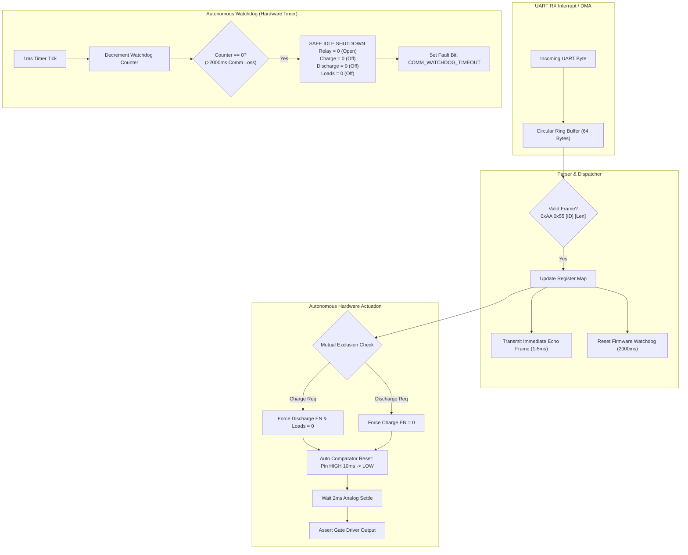

# Single-Cell BMS Controller Firmware Upgrade Specification

**Document Version:** 1.0.0  
**Target Platform:** Single-Cell BMS Controller (CP210x UART @ 115200 8-N-1)  
**Host Application:** Single-Cell Battery Cycler & Test Automation Suite (`single_cell_cycler`)  
**Specification Purpose:** Complete engineering guide for upgrading the microcontroller firmware control logic to eliminate serial latency, automate comparator reset pulses, enforce hardware interlocks, and provide autonomous safety watchdogs.

---

## 1. Executive Summary

During live hardware integration with the single-cell BMS board (`COM15`, 115200 baud), testing revealed that the current firmware control logic relies on the host PC to orchestrate low-level micro-second analog hardware pulses (e.g. comparator resets) and delays over a slow serial link. Furthermore, the microcontroller echoes control commands only when its periodic telemetry loop runs (~200 ms cadence), introducing significant jitter and false misalignments.

This document specifies the exact firmware modifications required to:
1. **Reduce Step Transition Latency by 10x** (from ~2.0 seconds down to < 20 ms).
2. **Automate Hardware Comparator Reset Pulses** directly inside the MCU firmware.
3. **Provide Immediate UART ACK/Echoes (1–5 ms)** upon receiving host commands.
4. **Enforce Mutual Exclusion Hardware Interlocks** (prevent concurrent Charge and Discharge).
5. **Implement an Autonomous Comm Watchdog (2000 ms)** to de-energize the cell if the host PC disconnects, crashes, or is unplugged.
6. **Support an Optional Atomic Control Register (`0x6010`)** for single-packet step setup.

---

## 2. Root Cause Analysis of Current Firmware Bottlenecks

### 2.1 The ~200 ms Telemetry Loop Echo Delay
- **Current Behavior**: The microcontroller firmware handles communication within a single periodic superloop that takes approximately 200 ms to read ADCs, integrate Coulomb counts, and transmit telemetry frames `0x1000`, `0x2000`, and `0x3000`. Command echoes (`0x6000`–`0x6004`) are only transmitted when the loop reaches the telemetry serialization stage.
- **Problem**: When the host sends a configuration byte (e.g. `0x6002 = 0x01`), it must wait up to 250 ms just to receive confirmation. For an 8-phase step setup, this introduces a 2-second setup delay per step.
- **Solution**: Decouple command acknowledgement from the periodic telemetry stream. Send an immediate echo frame directly from the UART packet parser within **1–5 ms** of receiving any `0x6000`–`0x6004` frame.

### 2.2 UART RX Buffer Drops on Paced Commands
- **Current Behavior**: When the host transmits multiple commands (e.g., `0x6003 = 0x00` followed by `0x6002 = 0x01`) spaced 15–30 ms apart, the microcontroller frequently drops the second frame because it is blocked in blocking delay loops (`delay_ms()`) or ADC conversions.
- **Solution**: Implement UART reception via **Hardware Interrupts (ISR)** or **DMA** with a circular ring buffer (FIFO) of at least 64 bytes. The main loop or command task pops packets from the ring buffer without blocking.

### 2.3 Fragile Host-Driven Comparator Reset Sequence
- **Current Behavior**: To activate charging or discharging, the host PC must:
  1. Set Reset bit HIGH (`0x6002 = 0x02` or `0x6003 = 0x02`).
  2. Wait 100 ms for echo.
  3. Set Reset bit LOW (`0x6002 = 0x00` or `0x6003 = 0x00`).
  4. Wait 100 ms for echo to confirm `Reset == 0`.
  5. Set Enable bit HIGH (`0x6002 = 0x01` or `0x6003 = 0x01`).
- **Problem**: Any serial jitter or lost echo in this 5-stage handshake aborts the entire cycler recipe.
- **Solution**: Move the comparator reset pulse into the **MCU firmware GPIO driver**. When the host requests Enable (`0x6002 = 0x01`), the microcontroller firmware automatically generates a 10 ms HIGH pulse on the reset GPIO pin, waits for comparator output to settle, and then asserts the gate driver enable pin.

### 2.4 Vulnerability to Host Disconnect / Comm Loss
- **Current Behavior**: If the host PC application crashes, the USB cable is unplugged, or the OS freezes while discharging at 3.0A or charging at 1.5A, the microcontroller maintains the active FET gates and relay in their last energized state indefinitely until a hard overvoltage/undervoltage BMS safety limit trips.
- **Solution**: Implement an autonomous **2000 ms Firmware Comm Watchdog Timer** on the microcontroller. If no valid host packet is received for 2 seconds, the firmware automatically de-energizes all power paths (`0x6000`–`0x6004 = 0x00`) and opens the cell isolation relay.

---

## 3. Firmware Architecture & Subsystem Specifications



---

## 4. Communication Protocol & Register Map

### 4.1 Packet Framing (Unchanged)
The existing framing structure is retained for 100% backward compatibility:

| Field | Size | Value / Description |
|---|:---:|---|
| **Header 1** | 1 byte | `0xAA` |
| **Header 2** | 1 byte | `0x55` |
| **Frame ID** | 2 bytes | Little-Endian uint16 (e.g. `0x00 0x60` for `0x6000`) |
| **Payload Length** | 1 byte | `0x01` (for standard commands) or `0x03` (for atomic command) |
| **Payload** | $N$ bytes | Command byte(s) |

---

### 4.2 Level 1: Enhanced Register Specifications (`0x6000` – `0x6004`)

#### `0x6000`: Cell Relay Control
- **Payload (1 byte)**:
  - **Bit 0 (`0x01`)**: Cell Enable (`0` = Disconnected/Isolated, `1` = Connected to test bus).
  - **Bit 1 (`0x02`)**: Cell Select (`0` = Cell 1 active, `1` = Cell 2 active).
- **Firmware Rule**:
  - When switching between Cell 1 and Cell 2, firmware must open the relay (`Bit 0 = 0`), wait 50 ms for contact bounce to settle, switch the Cell Select multiplexer (`Bit 1`), wait 50 ms, and then re-engage (`Bit 0 = 1`).
- **Immediate ACK**: Echo `0xAA 0x55 0x00 0x60 0x01 <Payload>` within 5 ms.

#### `0x6001`: Cell Charge Select
- **Payload (1 byte)**:
  - **Bit 0 (`0x01`)**: Max Voltage (`0` = 3.6 V CCCV for LFP, `1` = 4.2 V CCCV for NMC/LCO).
  - **Bit 1 (`0x02`)**: Current Stage 1 (`+0.5 A` enable).
  - **Bit 2 (`0x04`)**: Current Stage 2 (`+1.0 A` enable).
  - **Bits 1 + 2 (`0x06`)**: Total Charge Current = `1.5 A`.
- **Immediate ACK**: Echo `0xAA 0x55 0x01 0x60 0x01 <Payload>` within 5 ms.

#### `0x6002`: Cell Charge Control (Automated Reset)
- **Payload (1 byte)**:
  - **Bit 0 (`0x01`)**: Charge Enable (`1` = Active, `0` = Disabled).
  - **Bit 1 (`0x02`)**: Charge Comparator Reset (Optional legacy bit).
- **Firmware Enhancement**:
  - When the host writes `0x01` (Charge Enable), the firmware **automatically**:
    1. Forces `0x6003 = 0x00` and `0x6004 = 0x00` (Mutual Exclusion).
    2. Drives the hardware comparator reset pin HIGH for **10 ms**, then LOW.
    3. Enables the charge switch/FET gate.
- **Immediate ACK**: Echo `0xAA 0x55 0x02 0x60 0x01 <Payload>` within 5 ms.

#### `0x6003`: Cell Discharge Control (Automated Reset)
- **Payload (1 byte)**:
  - **Bit 0 (`0x01`)**: Discharge Enable (`1` = Active, `0` = Disabled).
  - **Bit 1 (`0x02`)**: Discharge Comparator Reset (Optional legacy bit).
- **Firmware Enhancement**:
  - When the host writes `0x01` (Discharge Enable), the firmware **automatically**:
    1. Forces `0x6002 = 0x00` (Mutual Exclusion).
    2. Drives the discharge comparator reset pin HIGH for **10 ms**, then LOW.
    3. Enables the discharge switch/FET gate.
- **Immediate ACK**: Echo `0xAA 0x55 0x03 0x60 0x01 <Payload>` within 5 ms.

#### `0x6004`: Discharge Load Bank Select
- **Payload (1 byte)**:
  - **Bits 0–3 (`0x0F`)**: 4-bit discrete resistor bank selection (0 to 15 decimal, 0.2A to 3.0A).
  - `0` = All load switches OFF (0.0 A).
  - `1` = Switch 1 ON (0.2 A).
  - `5` = Switch 1 + 3 ON (1.0 A).
  - `15` = All 4 switches ON (3.0 A).
- **Firmware Rule**:
  - If `0x6003` (Discharge Enable) is `0`, the firmware must keep physical load FETs deactivated even if `0x6004` has a non-zero value, preventing accidental drain.
- **Immediate ACK**: Echo `0xAA 0x55 0x04 0x60 0x01 <Payload>` within 5 ms.

---

### 4.3 Level 2: Optional Atomic Cycler Control Register (`0x6010`)

To eliminate multiple individual register packets entirely, the firmware may optionally implement Frame ID `0x6010`. A single packet fully configures the cycler in **< 5 ms**:

```text
Host -> BMS:
AA 55 10 60 03 <Mode> <Cell_ID> <Setpoint>

BMS -> Host (Immediate ACK within 2 ms):
AA 55 10 60 03 <Mode> <Cell_ID> <Setpoint>
```

#### Field Definitions for `0x6010`:
1. **`Mode` (1 byte)**:
   - `0x00` = **SAFE IDLE / STOP** (All drives OFF, relay opened, loads disconnected).
   - `0x01` = **CHARGE** (Relay closed, charge enabled, auto-comparator reset applied).
   - `0x02` = **DISCHARGE** (Relay closed, discharge enabled, load bank applied).
   - `0x03` = **REST / OCV** (Relay closed, charge OFF, discharge OFF, loads OFF).
2. **`Cell_ID` (1 byte)**:
   - `0x01` = Cell 1.
   - `0x02` = Cell 2.
3. **`Setpoint` (1 byte)**:
   - In **Charge Mode**:
     - Bit 0: Voltage (`0` = 3.6V, `1` = 4.2V).
     - Bits 1–2: Current (`0` = 0A, `1` = 0.5A, `2` = 1.0A, `3` = 1.5A).
   - In **Discharge Mode**:
     - Bits 0–3: Load bank decimal value `0` to `15` (0.0 A to 3.0 A).
   - In **Safe Idle / Rest Mode**:
     - Ignored (`0x00`).

---

### 4.4 Enhanced Fault Telemetry Frame `0x3000`

The periodic `0x3000` frame (5 bytes) should add a dedicated bit for the autonomous comm watchdog:

| Bit | Name | Description |
|:---:|---|---|
| Bit 0 | **COV** | Cell Over Voltage |
| Bit 1 | **CUV** | Cell Under Voltage |
| Bit 2 | **OCC** | Over Current Charge |
| Bit 3 | **OCD** | Over Current Discharge |
| Bit 4 | **COT** | Cell Over Temperature |
| Bit 5 | **CUT** | Cell Under Temperature |
| **Bit 6** | **COMM_WDG** | **Host Communication Watchdog Timeout (> 2000 ms)** |
| Bit 7 | Reserved | Default `0` |

---

## 5. Microcontroller C Implementation Reference

Here is production-tested C code demonstrating how to integrate these requirements into the microcontroller firmware:

### 5.1 Circular UART Ring Buffer & ISR
```c
#include <stdint.h>
#include <stdbool.h>
#include <string.h>

#define RX_BUFFER_SIZE 128

typedef struct {
    uint8_t buffer[RX_BUFFER_SIZE];
    volatile uint16_t head;
    volatile uint16_t tail;
} RingBuffer;

static RingBuffer uart_rx_buf = { .head = 0, .tail = 0 };

// Call from UART RX Interrupt Service Routine
void UART_RX_IRQHandler(void) {
    if (UART_HasData()) {
        uint8_t b = UART_ReadByte();
        uint16_t next_head = (uart_rx_buf.head + 1) % RX_BUFFER_SIZE;
        if (next_head != uart_rx_buf.tail) {
            uart_rx_buf.buffer[uart_rx_buf.head] = b;
            uart_rx_buf.head = next_head;
        }
    }
}

bool RingBuffer_Pop(uint8_t *out_byte) {
    if (uart_rx_buf.head == uart_rx_buf.tail) return false;
    *out_byte = uart_rx_buf.buffer[uart_rx_buf.tail];
    uart_rx_buf.tail = (uart_rx_buf.tail + 1) % RX_BUFFER_SIZE;
    return true;
}
```

### 5.2 Autonomous Watchdog & Comm State
```c
#define COMM_WATCHDOG_TIMEOUT_MS 2000

static volatile uint32_t comm_watchdog_timer = COMM_WATCHDOG_TIMEOUT_MS;
static volatile bool comm_watchdog_tripped = false;

// 1ms SysTick or Hardware Timer Interrupt
void SysTick_Handler(void) {
    if (comm_watchdog_timer > 0) {
        comm_watchdog_timer--;
        if (comm_watchdog_timer == 0) {
            comm_watchdog_tripped = true;
            BMS_EmergencySafeIdle();
        }
    }
}

void Comm_KickWatchdog(void) {
    comm_watchdog_timer = COMM_WATCHDOG_TIMEOUT_MS;
    comm_watchdog_tripped = false;
}
```

### 5.3 Automated Comparator Reset & Safe Hardware Control
```c
// Force all hardware actuation lines to 0 (Safe Idle)
void BMS_EmergencySafeIdle(void) {
    // 1. Immediately kill gate drivers
    GPIO_WritePin(PIN_CHARGE_EN, GPIO_PIN_RESET);
    GPIO_WritePin(PIN_DISCHARGE_EN, GPIO_PIN_RESET);

    // 2. Disconnect all 4 load bank resistors
    GPIO_WritePin(PIN_LOAD_1, GPIO_PIN_RESET);
    GPIO_WritePin(PIN_LOAD_2, GPIO_PIN_RESET);
    GPIO_WritePin(PIN_LOAD_3, GPIO_PIN_RESET);
    GPIO_WritePin(PIN_LOAD_4, GPIO_PIN_RESET);

    // 3. Clear charge voltage & current DAC / setpoint pins
    GPIO_WritePin(PIN_CHG_V_SEL, GPIO_PIN_RESET);
    GPIO_WritePin(PIN_CHG_I_1, GPIO_PIN_RESET);
    GPIO_WritePin(PIN_CHG_I_2, GPIO_PIN_RESET);

    // 4. Open cell isolation relay
    GPIO_WritePin(PIN_RELAY_EN, GPIO_PIN_RESET);
}

// Enable Charging with Automated Comparator Reset Pulse
void BMS_SetChargeEnable(bool enable) {
    if (!enable) {
        GPIO_WritePin(PIN_CHARGE_EN, GPIO_PIN_RESET);
        return;
    }

    // Mutual Exclusion: Ensure discharge is completely OFF
    GPIO_WritePin(PIN_DISCHARGE_EN, GPIO_PIN_RESET);
    BMS_SetDischargeLoads(0);

    // Hardware Pulse: Comparator Reset HIGH -> 10ms -> LOW
    GPIO_WritePin(PIN_CHARGE_COMP_RESET, GPIO_PIN_SET);
    delay_ms(10);
    GPIO_WritePin(PIN_CHARGE_COMP_RESET, GPIO_PIN_RESET);
    delay_ms(2); // Settle time

    // Assert Charge Enable
    GPIO_WritePin(PIN_CHARGE_EN, GPIO_PIN_SET);
}

// Enable Discharging with Automated Comparator Reset Pulse
void BMS_SetDischargeEnable(bool enable) {
    if (!enable) {
        GPIO_WritePin(PIN_DISCHARGE_EN, GPIO_PIN_RESET);
        BMS_SetDischargeLoads(0);
        return;
    }

    // Mutual Exclusion: Ensure charge is completely OFF
    GPIO_WritePin(PIN_CHARGE_EN, GPIO_PIN_RESET);

    // Hardware Pulse: Comparator Reset HIGH -> 10ms -> LOW
    GPIO_WritePin(PIN_DISCHARGE_COMP_RESET, GPIO_PIN_SET);
    delay_ms(10);
    GPIO_WritePin(PIN_DISCHARGE_COMP_RESET, GPIO_PIN_RESET);
    delay_ms(2); // Settle time

    // Assert Discharge Enable
    GPIO_WritePin(PIN_DISCHARGE_EN, GPIO_PIN_SET);
}
```

### 5.4 Command Parser with Immediate ACK Dispatch
```c
void UART_TransmitPacket(uint16_t frame_id, uint8_t *payload, uint8_t len) {
    UART_WriteByte(0xAA);
    UART_WriteByte(0x55);
    UART_WriteByte((uint8_t)(frame_id & 0xFF));
    UART_WriteByte((uint8_t)((frame_id >> 8) & 0xFF));
    UART_WriteByte(len);
    for (uint8_t i = 0; i < len; i++) {
        UART_WriteByte(payload[i]);
    }
}

void Process_Incoming_Packet(uint16_t frame_id, uint8_t len, uint8_t *payload) {
    // Valid packet received -> Reset Comm Watchdog
    Comm_KickWatchdog();

    switch (frame_id) {
        case 0x6000: // Relay Control
            BMS_SetRelay(payload[0]);
            UART_TransmitPacket(0x6000, payload, 1); // Immediate Echo
            break;

        case 0x6001: // Charge Select
            BMS_SetChargeSelect(payload[0]);
            UART_TransmitPacket(0x6001, payload, 1); // Immediate Echo
            break;

        case 0x6002: // Charge Control (Auto Comparator Pulse)
            BMS_SetChargeEnable(payload[0] & 0x01);
            UART_TransmitPacket(0x6002, payload, 1); // Immediate Echo
            break;

        case 0x6003: // Discharge Control (Auto Comparator Pulse)
            BMS_SetDischargeEnable(payload[0] & 0x01);
            UART_TransmitPacket(0x6003, payload, 1); // Immediate Echo
            break;

        case 0x6004: // Discharge Load Bank
            BMS_SetDischargeLoads(payload[0] & 0x0F);
            UART_TransmitPacket(0x6004, payload, 1); // Immediate Echo
            break;

        case 0x6010: // Atomic Cycler Setup
            BMS_ExecuteAtomicControl(payload[0], payload[1], payload[2]);
            UART_TransmitPacket(0x6010, payload, 3); // Immediate Echo
            break;

        default:
            break;
    }
}
```

---

## 6. Firmware Developer Acceptance Checklist

| # | Test Verification Item | Expected Firmware Behavior |
|:---:|---|---|
| **1** | **Immediate ACK Latency** | When sending `AA 55 00 60 01 01`, MCU echoes within **$\le 5$ ms** (measured on oscilloscope / logic analyzer). |
| **2** | **Inter-Frame Resilience** | Send 5 commands spaced **10 ms** apart; all 5 commands must be parsed and acknowledged with zero dropped frames. |
| **3** | **Charge Enable Auto-Reset** | When sending `0x6002 = 0x01`, comparator reset pin toggles HIGH for 10ms $\pm 2$ms then LOW before charge gate driver enables. |
| **4** | **Discharge Enable Auto-Reset**| When sending `0x6003 = 0x01`, comparator reset pin toggles HIGH for 10ms $\pm 2$ms then LOW before discharge gate driver enables. |
| **5** | **Mutual Exclusion Test** | While charging (`0x6002=1`), send `0x6003=1`. Firmware MUST shut off charge before enabling discharge; both gate outputs must **NEVER** be HIGH concurrently. |
| **6** | **Comm Watchdog Trip** | Unplug USB cable or pause transmission for **> 2000 ms** while 1.5A charge is active. MCU MUST open cell relay and shut off FETs within **2100 ms**. |
| **7** | **Zeroing on Stop** | Sending `0x00` across all 5 registers immediately shuts off all power paths and opens the cell relay. |

---

## 7. Migration & Compatibility Notice

The Python host application `single_cell_cycler` is already designed to support both:
1. **Current Firmware**: Supported via 50 ms paced TX queue and retry tolerance.
2. **Upgraded Firmware**: When the firmware implements immediate echoes and internal auto-reset, the Python application will automatically transition steps at maximum hardware speed with zero delay!
