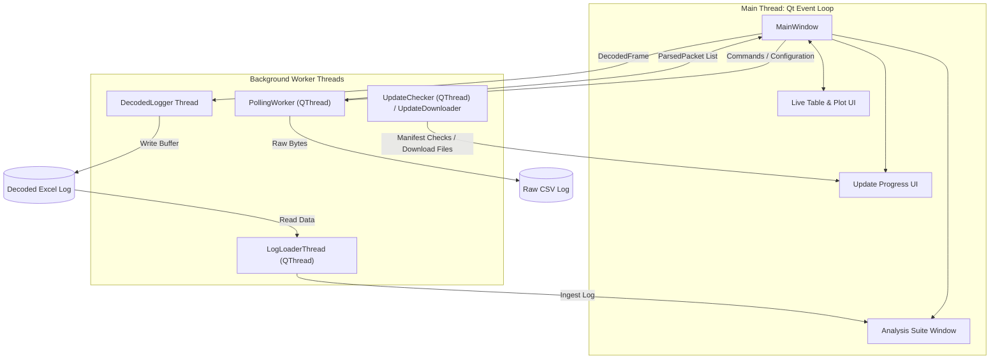
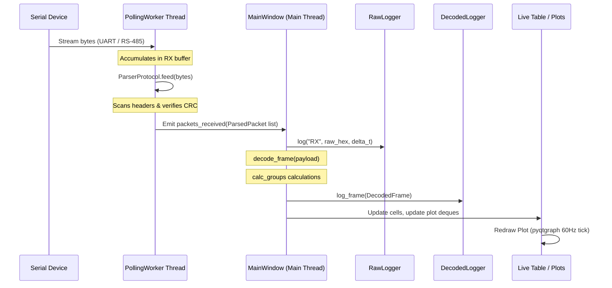
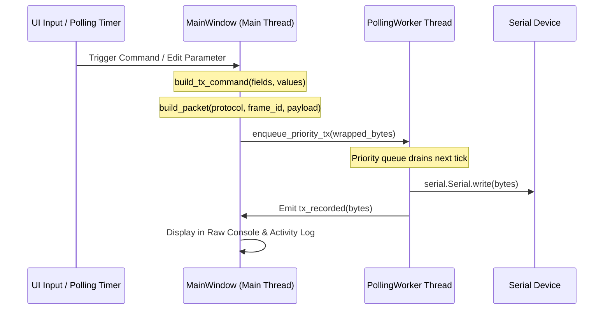
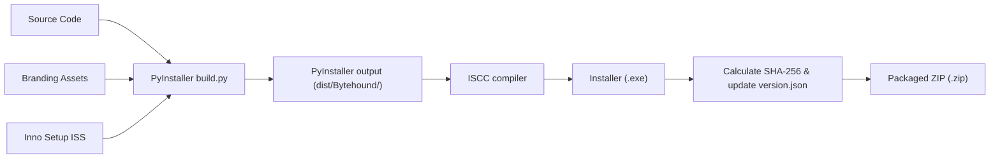

# Bytehound Technical Architecture Document

## 1. Directory Structure & Module Boundaries

Bytehound enforces strict modular boundaries to separate core business logic, protocol decoding, serial I/O, and the graphical user interface. This separation ensures that the decoding and parsing layers can be unit-tested in isolation without invoking a Qt event loop or initializing physical hardware.

```
Bytehound/
├── app/
│   ├── main.py                         # Application Entry Point & Exception Hook
│   ├── commands/
│   │   └── tx_command_builder.py       # User Input -> TX Command Binary Encoder
│   ├── decoder/
│   │   ├── types.py                    # Schema Dataclasses & Enums
│   │   ├── config_loader.py            # Excel/CSV Schema Parser & Validator
│   │   ├── frame_decoder.py            # Raw Binary Payload -> Decoded Signals
│   │   ├── calculations.py             # Math Aggregator (Min/Max/Avg/Sum/Diff)
│   │   └── template_io.py              # Export Blank Workbook Templates
│   ├── protocol/
│   │   ├── crc.py                      # CRC16 (Modbus/CCITT), CRC32 Calculations
│   │   ├── packet_parser.py            # Sliding Window & Modbus RTU Stream Parsers
│   │   └── packet_builder.py           # Wrapped Wire-Packet Generator
│   ├── serial_io/
│   │   └── serial_worker.py            # Threaded Polling and Priority TX Worker
│   ├── serial_logging/
│   │   ├── raw_logger.py               # Streaming CSV Hex Packet Logger
│   │   └── decoded_logger.py           # Thread-Safe Decoded Excel Workbook Logger
│   ├── ui/
│   │   ├── main_window.py              # Main GUI Controller & Dock Manager
│   │   ├── ui_builders.py              # Dock Widget Generators & Promotions
│   │   ├── detail_tabs.py              # Status Tables, Enums, and Bitfield Mixins
│   │   ├── plot_orchestration.py       # Live Plot Canvas Controllers & Settings
│   │   ├── analysis_suite.py           # Offline Log Reviewer (Sub-Window)
│   │   ├── theming.py                  # Dark/Light/Auto Palette Resolvers
│   │   └── updater.py                  # Manifest checker and silent downloader
│   └── resources/
│       ├── index.html                  # In-app user manual HTML
│       └── frame_config_template.xlsx  # Reference template spreadsheet
└── tests/                              # Pytest suite
```

### Module Boundary Constraints
* **Pure Logic Modules (`app/decoder/`, `app/protocol/`, `app/commands/`)**: Must not import PySide6 modules or initiate network/file I/O. They must remain pure Python functions.
* **Logging Module (`app/serial_logging/`)**: Handles file writes and streams, operating independently of the UI.
* **UI Module (`app/ui/`)**: The exclusive location for PySide6 widgets, custom delegates, layouts, and styles.

---

## 2. Threading Model & Concurrency

Bytehound utilizes a multi-threaded architecture to guarantee that serial communications, file writing, and UI rendering do not block one another, preventing visual stutter or packet loss during high-baud-rate transfers.



### Thread Descriptions
1. **Main Thread**: Runs the Qt event loop, processes mouse/keyboard interactions, manages window geometry, and renders the graphics canvas (pyqtgraph) at 60 Hz.
2. **Polling Worker Thread (`PollingWorker`)**: Inherits from `QThread`. It holds the active `serial.Serial` socket. It runs a continuous loop that executes the polling schedule, drains the physical RX buffer, runs the stream unframer, and enqueues outbound commands.
3. **Log Ingestion Thread (`LogLoaderThread`)**: Runs inside the Analysis Suite. It parses large historic log workbooks off-thread so the GUI does not freeze during file ingestion.
4. **Update Thread (`UpdateChecker`/`UpdateDownloader`)**: Spawns on-demand to run non-blocking HTTP requests for checking manifests and streaming update binaries.

---

## 3. Data Pipelines

### 3.1 Receiver (RX) Pipeline
The RX pipeline processes incoming serial streams, converting raw bytes into structured telemetry and displaying them in real time.



1. **Physical Read**: `PollingWorker` reads raw data from `serial.Serial.read(in_waiting)`.
2. **Unframing**: Bytes are passed to `ParserProtocol.feed()`. The `FramedParser` or `ModbusRtuParser` aligns the stream to packet headers, extracts the frame ID and payload, and validates the packet integrity.
3. **Main Thread Dispatch**: Valid packets are batched and emitted via the `packets_received` signal.
4. **Decoding & Logging**: The `MainWindow` intercepts the signal:
   * It logs the raw packet direction, bytes, and arrival delta to the raw CSV log.
   * It decodes the binary payload into engineering values using the configuration schema (converting raw integers/floats based on byte order, scale, and offset).
   * It computes virtual aggregates (groups).
   * It dispatches the fully decoded frame to the `DecodedLogger` cycle buffer and updates the live data tables and plot memory rings.

### 3.2 Transmitter (TX) Pipeline
The TX pipeline encodes user inputs or automated polling triggers into formatted frames and sends them out to the wire.



1. **Trigger**: The user clicks a command button, hits enter on a parameter write field, or a polling interval expires.
2. **Encoding**: `build_tx_command()` processes user-input values, applies scale/offset reverse calculations, clamps within boundaries, packs the variables using `struct.pack`, and appends them to any static payload.
3. **Wrapping**: `build_packet()` wraps the payload in the protocol envelope (adding header, frame ID, length, CRC, footer, and padding if specified).
4. **Queue & Dispatch**: The main thread pushes the wrapped bytes into the `PollingWorker` priority queue. The worker thread intercepts it, preempts the normal polling schedule, writes to the COM port, and reports the event back to the UI.

---

## 4. Key Subsystem Implementation Details

### 4.1 Parser Protocol State Machine
The framed parser recovers from transmission noise by shifting its search window incrementally:
* If the buffer is smaller than the header size, it waits.
* If a header pattern matches but is not at index `0`, the parser discards the garbage prefix.
* It extracts the frame ID and payload length. If the buffer is incomplete, it yields and waits for more data.
* Once the expected size is available, it verifies the trailing checksum and footer.
* **Corrupt Data Recovery**: If the CRC checks fail or a footer is missing, the parser emits a failure signal and **advances the search buffer by exactly 1 byte** (resyncing), ensuring it does not lock up on corrupt blocks.

### 4.2 Configuration Loading & Validation
The `load_config(path)` function handles both workbook (`.xlsx`) files and directories of CSV files:
* Sheet tables are read into Pandas DataFrames and column headers are normalized (converted to lowercase, removing non-alphanumeric characters).
* **Validation Rules**:
  * Exactly one active protocol profile must be configured.
  * Within any frame ID, byte offsets must not overlap.
  * Duplicate signal names inside the same frame are treated as a fatal `ConfigError`.
  * Group identifiers in `calc_groups` must correspond to active signals in `variables`.

### 4.3 Serial Polling & Scheduler Fairness
To coordinate polling schedules and user-triggered priority writes, the `PollingWorker` executes a prioritized loop:
* **Priority Command Draining**: The worker first checks the bounded `Queue(maxsize=256)` of priority commands. If present, it writes the command and yields.
* **Round-Robin Telemetry Polling**: Instead of scanning schedules from index `0` every tick (which allows fast-interval schedules at the top of the list to starve slow-interval schedules at the bottom), the worker maintains a `_sched_cursor` index. The scheduler searches starting at the cursor, executes the next due query, and advances the cursor immediately after.
* **Boot-Grace Gate**: After connection, polling is blocked for 2.5 seconds or until the first byte arrives. This accommodates DTR-induced resets on microcontrollers, preventing write collisions during their boot sequence.

### 4.4 Logging & Buffered Writing
To ensure performance does not degrade during long-duration runs:
* **`RawLogger`**: Uses simple file handles, writing CSV strings directly and forcing a flush to disk every 0.5 seconds.
* **`DecodedLogger`**: Implements a cycle buffer. It collects individual incoming frames. The block write is triggered only when the *last* frame declared in the `frames` configuration sheet arrives. The logger organizes the variables side-by-side into a synchronized wide layout, keeping RAM usage low. The logger writes the worksheet to disk only when the session stops.

---

## 5. Build and Packaging Process

The build system compiles the Python source and dependencies into a stand-alone, zero-install Windows package.



1. **Clean**: The `build.py` orchestrator removes prior `build/` and `dist/` outputs.
2. **Compilation**: It invokes PyInstaller using `Bytehound.spec` to create a folder structure. 
   * The spec excludes alternate bindings (PyQt5, PyQt6, PySide2) and includes PySide6 dependencies (`shiboken6`).
3. **Branding Insertion**: Post-compile, `build.py` copies icon (`.ico`) and logo (`.png`) assets from the `branding/` folder to the root of the distribution directory. (This matches the runtime `_find_logo` search order, which checks next to the executable before looking in nested directories).
4. **Installer Compilation**: It executes Inno Setup (`ISCC.exe installer.iss`), creating a silent offline wizard (`Bytehound_Setup_X.Y.Z.exe`).
5. **SHA-256 Validation**: The script calculates the SHA-256 hash of the final installer file and writes it into `version.json`. The local manifest updates dynamically, ensuring that the auto-updater can verify the payload during future downloads.
